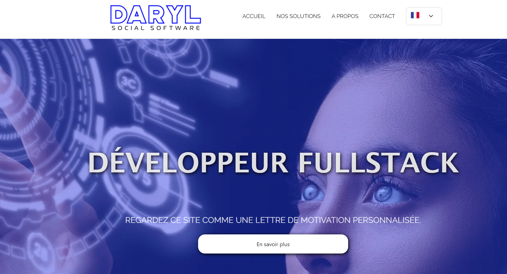

# Candidature-dev-DarylSoftware


## Description

L'objectif de ce site est de permettre aux utilisateurs de créer une lettre de motivation personnalisée aux couleurs de l'entreprise DarylSoftware. Un lien vers le site original de l'entreprise est inclus dans le pied de page.

## Liens

- **GitHub Repository**: [https://github.com/PierreGAMEN/candidature_DARYL](https://github.com/PierreGAMEN/candidature_DARYL)
- **Live Site**: [https://candidature-darylsoftware.netlify.app/](https://candidature-darylsoftware.netlify.app/)

## Technologies Utilisées

- **Frontend** : React, Vite, SCSS

## Aperçu



## Installation et Utilisation

Pour installer et utiliser ce projet localement, suivez ces étapes :

1. Clonez le dépôt GitHub :
   ```bash
   git clone https://github.com/PierreGAMEN/candidature_DARYL.git